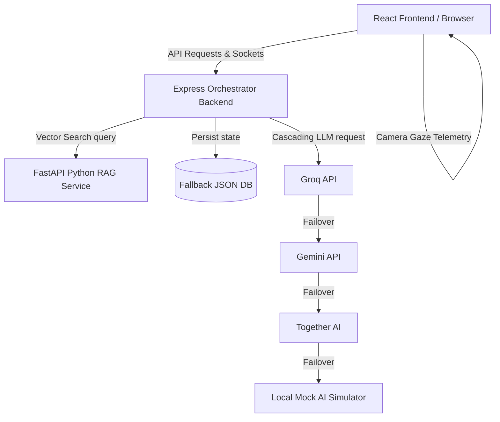

# VIDYA AI — Systems Architecture

This document describes the architectural flow, vector RAG search pathways, multi-tier LLM fallback routing, and client-side attention telemetry systems for **VIDYA AI**.

---

## 🗺 System Topology

VIDYA AI is engineered using a three-tier decoupled service topology:

---

## 🔍 Retrieval-Augmented Generation (RAG) Architecture

The `rag-service` exposes an endpoint `/search` that queries curriculum-aligned chapters from NCERT textbooks.

### 1. Neural Semantic Vector Pathway
* **Embeddings**: `paraphrase-multilingual-MiniLM-L12-v2` encodes both queries and documents.
* **Vector Store**: ChromaDB matches embeddings using cosine similarity.

### 2. Pure-Math Fallback Pathway
If ChromaDB or Sentence-Transformers are unavailable (e.g. system is offline or missing PyTorch compilers), the service switches to a custom **TF-IDF Vector similarity matcher** written in pure Python.
* Tokens are filtered, and term frequencies (TF) and inverse document frequencies (IDF) are computed dynamically.
* Matches are computed using the Cosine Similarity formula:
  $$\text{Similarity} = \frac{A \cdot B}{\|A\| \|B\|}$$

---

## 🤖 Multi-Tier LLM Fallback Chain

To maintain 100% availability for hackathon demos and production workloads, the orchestrator handles API requests using a cascading fallback proxy:

1. **Groq (Llama 3.3 70B)**: Executed first for high-speed, open-source LLM generation.
2. **Google Gemini**: Initiated if Groq fails or credentials are empty.
3. **Together AI (Llama 3 70B)**: Executed if Gemini fails.
4. **Local Bilingual Simulation Engine**: Runs locally on Express.js to parse topics, generate Socratic dialogue, and return regional script answers if all network calls fail.

---

## 👁 Browser-Side Attention Telemetry

VIDYA AI respects user privacy. FaceMesh tracking is executed entirely on the client-side:

* **Landmarks Selection**: MediaPipe landmarks map left and right eyelids.
* **Eye Aspect Ratio (EAR)**:
  $$\text{EAR} = \frac{\|\mathbf{p}_2 - \mathbf{p}_6\| + \|\mathbf{p}_3 - \mathbf{p}_5\|}{2\|\mathbf{p}_1 - \mathbf{p}_4\|}$$
  If the EAR average drops below $0.16$ for more than 2 seconds, a drowsiness alert triggers, alerting the student of study fatigue.
* **Yaw Ratio**: Compares left-to-nose vs right-to-nose horizontal spacing. Deviations greater than $35\%$ indicate the student is looking away, updating the Focus Meter logs.
